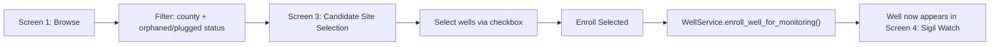
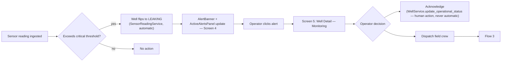
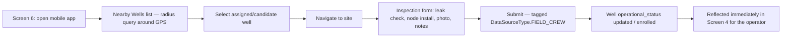

# UI Design — screens, components, interaction, wireframes

`UI_PLANNING.md` established the shape of the problem (two distinct UI
modes, the 1.4M-well scale problem, map provider tradeoffs, GIS
software for analysts). This doc goes one level more concrete: the actual
screens, the components they're built from, how a user moves through them,
and low-fidelity wireframes for the core six. Still no UI code — this is
design, not implementation, per the same direction as `UI_PLANNING.md`.

Wireframes: [`wireframes/wireframes.html`](wireframes/wireframes.html) —
open directly in a browser, no build step or server needed.

## Grounding this in prior art, not just first principles

Two design traditions apply here, matching the two UI modes from
`UI_PLANNING.md`:

- **Industrial alarm/SCADA conventions** (relevant to the "Monitor" /
  Sigil Watch mode) — governed in the real world by ISA-101 and IEC 63303.
  The two rules that matter most for this design: **red and amber are
  reserved exclusively for alarm states** — nothing else on screen uses
  those colors, so when an operator sees red it means something, not
  "also the brand accent color" — and **dark backgrounds are standard for
  control-room displays** viewed for long stretches in dim rooms (which
  also happens to match `well-monitor`'s existing dark aesthetic and the
  "SIGILINT EDGE" branding already in place).
- **Environmental sensor monitoring dashboards** (relevant to both modes,
  but especially the well-detail views) — the common pattern is a map for
  location context, a sensor list/detail with live values + threshold bars
  + sparklines, and a dedicated alerts panel that shows only currently
  deviating readings rather than every sensor all the time. This is
  already close to what `well-monitor/info-panel.jsx` prototypes
  (pollutant bars, sparklines, limit thresholds) — validates that
  direction rather than suggesting a different one.

## Screen inventory

Six core screens, split across the three user types from `UI_PLANNING.md`
(analyst, operator, field crew):

| # | Screen | User | Backend it's built on |
|---|---|---|---|
| 1 | Browse / Search | Analyst | `WellService.search` (`WellSearchQuery`) |
| 2 | Well Detail — Regulatory | Analyst | `WellService.get_well` |
| 3 | Candidate Site Selection | Analyst | `WellService.list_monitoring_candidates` + `enroll_well_for_monitoring` |
| 4 | Sigil Watch Dashboard | Operator | `WellService.search(monitored_only=True)` + live `SensorReadingService` alerts |
| 5 | Well Detail — Monitoring | Operator | `SensorReadingService.get_latest_snapshot` / `.get_history`, `WellService.update_operational_status` |
| 6 | Field Crew (mobile) | Field crew | `WellService.list_monitoring_candidates` (radius query) + readings/status tagged `DataSourceType.FIELD_CREW` |

### 1. Browse / Search

The RRC-inventory browser — this is where "every well in Tarrant County"
lives. Map + filterable list, split view. Filters map directly onto
`WellSearchQuery` fields: county, district, operator, regulatory status
(multi-select), orphaned-only / monitored-only toggles, free text (API
number / well number / lease name). At the scale problem's default zoom
(county or wider), the map shows clustered counts, not individual pins —
see `UI_PLANNING.md` "The scale problem" for why. Selecting a well (map pin
or list row) opens Screen 2.

### 2. Well Detail — Regulatory

A slide-in panel/modal, not a full page — it's reached from within Screen
1 or 3 and should keep the map/list context visible behind it. Shows
location, RRC's regulatory status (both the normalized bucket and the raw
RRC text, per the domain model's "two status axes" — see
`ARCHITECTURE.md`), and **identity provenance**: `identity_method` and
`source_feature_count` from the well-identity-resolution work (e.g. "this
well's identity was resolved by clustering 3 unlabeled RRC records" — see
`ARCHITECTURE.md` "Well identity resolution"), surfaced as a small badge
rather than buried, since a spatially-resolved identity is inherently
lower-confidence than a real RRC API match and a user comparing this
against RRC's own site should know which kind they're looking at. If the
well isn't yet monitored, an "Enroll for Monitoring" action is here.

### 3. Candidate Site Selection

The single highest-value screen for the actual POC-03 program (per
`UI_PLANNING.md`) — this is where "which abandoned wells should we put a
Sigil Node on next" gets answered. Same map+list shape as Screen 1, but
scoped to `list_monitoring_candidates` (RRC-orphaned or
plugged/abandoned/dry, and not already monitored) with checkboxes for bulk
selection and a persistent bottom action bar (`N wells selected` → `Enroll
Selected` / `Export`). Candidate wells render visually distinct on the map
(outlined, not just colored) so they read as "actionable" rather than just
another status category.

### 4. Sigil Watch Dashboard

The operator's home screen — dark theme, alarm colors reserved. Map shows
**only instrumented wells** (a small, bounded set — no clustering-at-scale
problem here, unlike Screen 1), colored by `OperationalStatus` (not
`RegulatoryStatus` — this is the axis that matters to an operator). A
persistent **Active Alerts** panel lists only wells currently past a
threshold (mirrors the SCADA "show only deviating tags" convention above),
each with a one-click path into Screen 5. A global banner surfaces when
any well is `LEAKING`, consistent with `SensorReadingService` never
auto-clearing that state — the UI shouldn't let it get quietly buried
either.

### 5. Well Detail — Monitoring

The richer sibling of Screen 2, for instrumented wells: current sensor
snapshot as a grid of metric cards (value + unit + threshold bar +
sparkline per `metric_code` — deliberately generic, not hardcoded to
CH4/H2S/BTEX/VOC/CO2, since `MetricReading.metric_code` isn't a closed set
either, see `ARCHITECTURE.md` "Why metrics aren't an enum"), an alert
history log (when a threshold was breached, by how much, whether/when
acknowledged), and the regulatory summary from Screen 2 kept as a
secondary/collapsed section rather than dropped — an operator responding
to a leak still benefits from knowing the well's RRC history. Actions:
acknowledge/clear a `LEAKING` state (a human decision, per
`ARCHITECTURE.md` — the system never does this on its own), log a field
visit, mark offline, decommission.

### 6. Field Crew (mobile)

Narrow-viewport, offline-tolerant (see `UI_PLANNING.md` "Mobile /
field-crew app"). A "Nearby Wells" list — candidate or assigned wells
within a radius of the device's GPS position, the same spatial query
machinery as Screen 1/3 just centered differently. Tapping a well opens an
inspection form (leak check, node-installed toggle, photo, notes) whose
submission is exactly a `SensorReadingService`/`WellService` call tagged
`DataSourceType.FIELD_CREW` — not a separate data path that needs
reconciling later.

## Component inventory

Shared building blocks, reused across the six screens rather than
rebuilt per-screen:

**Navigation / chrome**
- `ModeSwitcher` — Browse ↔ Monitor, the top-level split from `UI_PLANNING.md`
- `SearchBar` — free-text, debounced, feeds `WellSearchQuery.text`
- `FilterPanel` — county/district/operator/status/orphaned/monitored controls
- `Pagination` / infinite-scroll list footer

**Map**
- `MapCanvas` — MapLibre GL per `UI_PLANNING.md`'s recommendation
- `WellMarker` — single well, colored by whichever status axis the current
  mode cares about (regulatory in Browse, operational in Monitor)
- `ClusterMarker` — aggregate count, Browse mode only at low zoom
- `MapLegend` — status color key, mode-aware

**List / table**
- `WellListItem` — one row: id, status pill, short location, selectable
  (checkbox) in Screen 3
- `BulkActionBar` — "`N` selected" + action buttons, Screen 3 only

**Detail**
- `StatusPill` — reused everywhere; color + label driven by whichever
  enum applies (`RegulatoryStatus` or `OperationalStatus`), never both at
  once in the same pill (keeps the "two axes" distinction legible in the
  UI, not just in the data model)
- `IdentityProvenanceBadge` — "resolved via spatial clustering (3
  records)" / "RRC API" — Screen 2 and 5
- `MetricCard` — value, unit, threshold bar, sparkline — Screen 5
- `Sparkline` — small trend line; `well-monitor/info-panel.jsx` already
  has a working version of this, reusable as a starting point
- `AlertHistoryList` — timestamped breach/acknowledge log — Screen 5
- `ActionButton` set — Enroll / Acknowledge / Log Visit / Decommission,
  context-dependent per screen

**Alerts**
- `AlertBanner` — global, appears only when something needs attention
- `ActiveAlertsPanel` — persistent list, Screen 4

**Mobile**
- `NearbyWellsList` / `WellCard` (touch-sized)
- `InspectionForm`

## Interaction flows

Three flows tying the screens together — these are the actual jobs the
UI needs to get someone through, not just a list of screens.

### Flow 1 — Analyst: find and enroll candidate wells

### Flow 2 — Operator: respond to a leak alert

### Flow 3 — Field crew: inspect and enroll on-site

## What's still open

Same caveats as `UI_PLANNING.md` "Open questions": no auth/role model
designed yet (these screens assume analyst/operator/field-crew as given,
not enforced), and whether Browse and Monitor ship as one app with a mode
switch or two apps sharing the backend is still undecided — the component
list above is written to work either way (nothing here assumes a single
shared shell).
